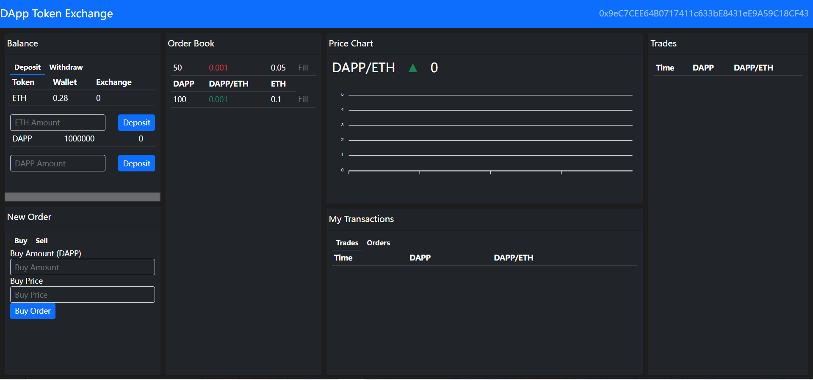

# blockchain-developer-bootcamp

一个blockchain开发的小demo dapp，只能说是体验一下dapp的开发流程


整个教程solidity合约编写的部分很少，感觉更像一个react前端教程（

总之不推荐，视频太久远了，坑很多。


~~整了很久，dapp本地是实现了，但是最后部署到goerli测试网上的部分寄了~~

~~最后部署的时候，在truffle-config.js报错：`Error: Could not create addresses from your mnemonic or private key(s). Please check that your inputs are correct.`~~

```js
const HDWalletProvider = require("@truffle/hdwallet-provider");
goerli: {
      provider: function() {
        return new HDWalletProvider({
          privateKeys: privateKeys,
          providerOrUrl: `https://goerli.infura.io/v3/${infuraApiKey}`
        })
      },
      gas: 5000000,
      gasPrice: 25000000000,
      network_id: 5,
    },
```

~~我感觉代码没有问题，估计是包之间依赖版本的问题，懒得弄了~~

~~断断续续写了两个月左右，打算到这里就结束了，不更新了~~


修好了，添加networkCheckTimeout，包换成truffle-hdwallet-provider，成功部署

```js
const HDWalletProvider = require('truffle-hdwallet-provider')
goerli: {
      networkCheckTimeout: 60000,
      provider: function() {
        return new HDWalletProvider(
          privateKeys,
          `https://goerli.infura.io/v3/${infuraApiKey}`
        )
      },
      gas: 5000000,
      gasPrice: 25000000000,
      network_id: 5,
    },
```

合约链上地址

> Exchange: 0xEc1d50b271e19Ef68090e296f110246bb2C5e88C
> Migrations: 0x598167e8386f18cfe99085Da17fE09624Ef59bb0
> Token: 0xA4c6Dd587Cf6046DeB3EB7A8F7D77d13A414B8bb

最终选择部署到heroku上

https://dapp-exchange-bootcamp.herokuapp.com/



done（2022.11.21）


视频教程：[区块链开发训练营(从0教你开发dapp)_哔哩哔哩_bilibili](https://www.bilibili.com/video/BV153411N7to/?spm_id_from=333.1007.top_right_bar_window_custom_collection.content.click&vd_source=a4188fa41affd328ccd5e9743098a6e0)

部分参考：[Linhieng/learn-dapp (github.com)](https://github.com/Linhieng/learn-dapp)
